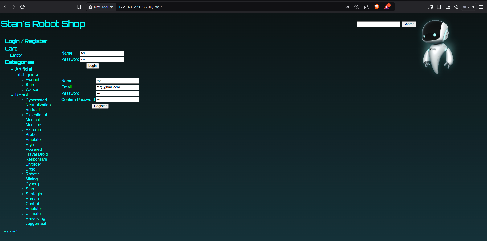
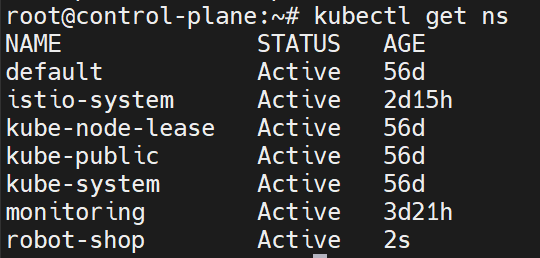
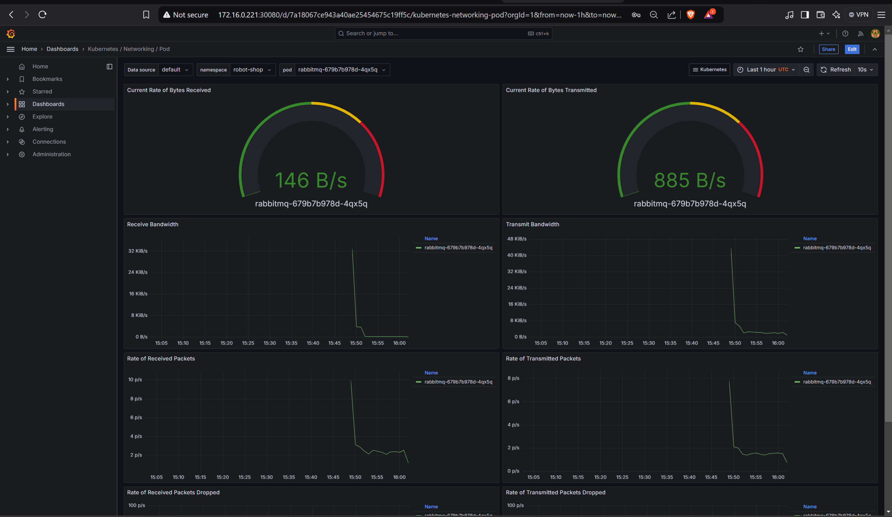
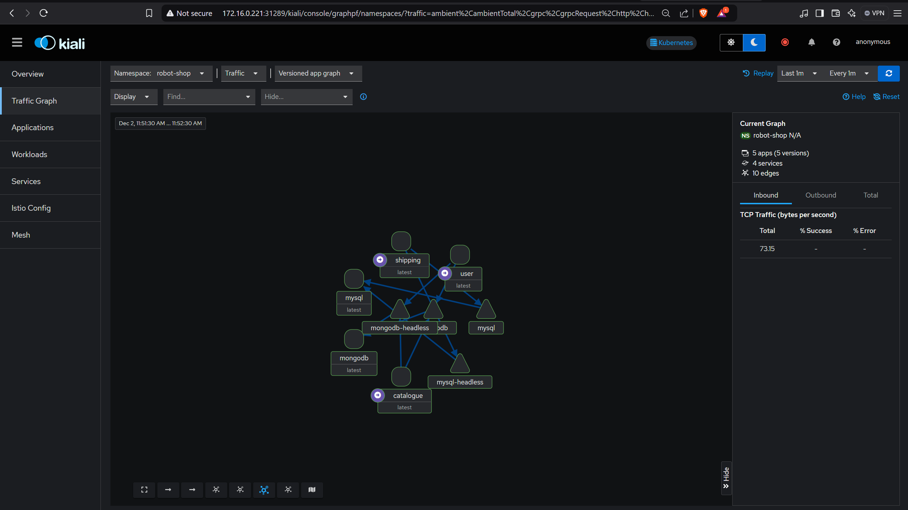
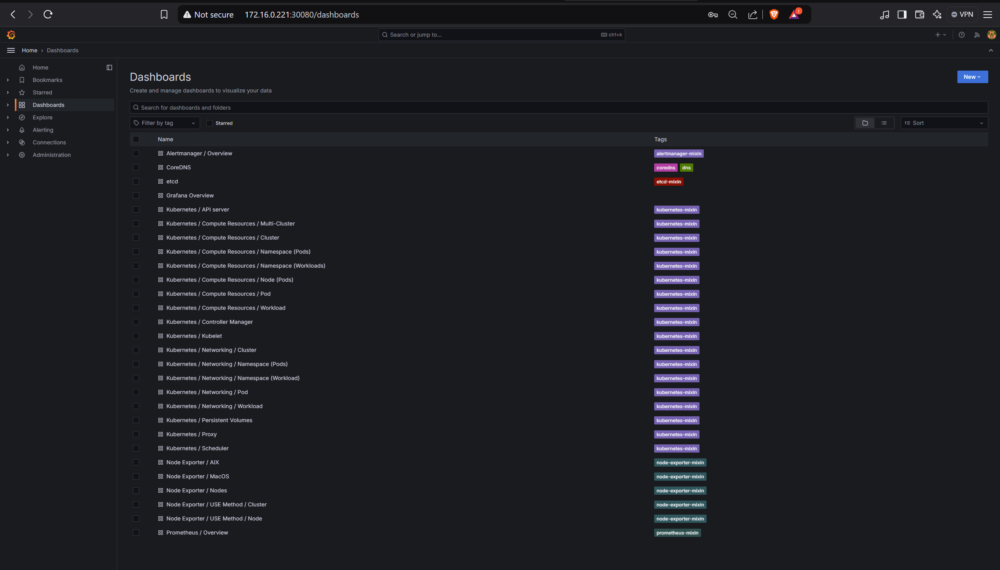
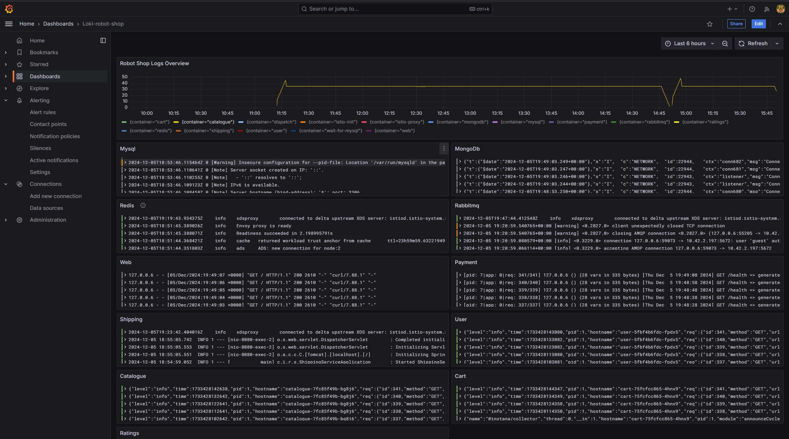
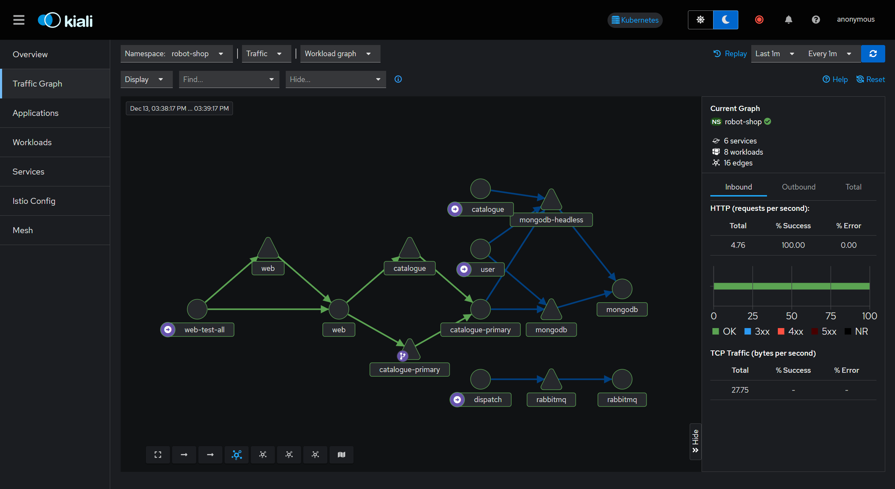
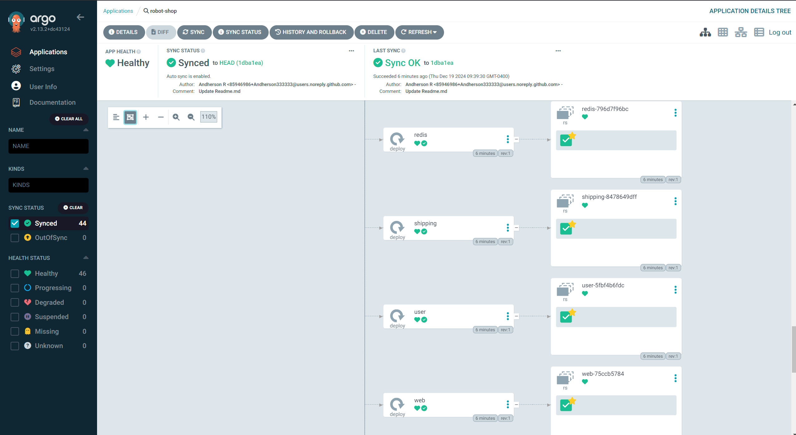

# 🤖 Robot Shop: Implementación Multi-Entorno GitOps

<p align="center">
  
</p>

<p align="center">
  <a href="#entornos">Entornos</a> •
  <a href="#arquitectura">Arquitectura</a> •
  <a href="#características">Características</a> •
  <a href="#instrucciones">Instrucciones</a> •
  <a href="#observabilidad">Observabilidad</a> •
  <a href="#comparativa-de-entornos">Comparativa</a>
</p>

## 📋 Descripción

Este proyecto implementa la aplicación **Robot Shop** en una progresión de tres entornos: desde Docker Compose local hasta Kubernetes en AWS EKS, aplicando prácticas modernas de DevOps, GitOps, observabilidad y seguridad.

## 🌐 Entornos

<table>
<tr>
  <td width="33%" align="center"><h3>Docker Compose</h3></td>
  <td width="33%" align="center"><h3>Kubernetes On-Premise</h3></td>
  <td width="33%" align="center"><h3>AWS EKS</h3></td>
</tr>
<tr>
  <td><b>Local y Simple</b><br>Ideal para desarrollo, rápido de configurar, sin dependencias de Kubernetes.</td>
  <td><b>Capacidades Completas</b><br>Implementación local de Kubernetes con monitoreo, service mesh y despliegues canary.</td>
  <td><b>Producción Cloud</b><br>Infraestructura como código, escalado automático, alta disponibilidad y análisis de costos.</td>
</tr>
</table>

## 🏗️ Arquitectura

### Microservicios

<p align="center">
  
</p>

Robot Shop consta de **10 microservicios interconectados**:

- **Frontend**: Nginx + AngularJS
- **Servicios Backend**: Catalogue, User, Cart, Shipping, Payment, Ratings, Dispatch
- **Bases de Datos**: MongoDB, MySQL, Redis
- **Mensajería**: RabbitMQ

### Observabilidad y DevOps

<p align="center">
  
</p>

Stack completo implementado en cada entorno:

- **Monitoreo**: Prometheus + Grafana
- **Trazabilidad**: Jaeger
- **Service Mesh**: Istio + Kiali
- **Logs**: Loki + Promtail
- **GitOps**: ArgoCD
- **Despliegues Canary**: Flagger

## ✨ Características

<table>
<tr>
  <td><h3>📊 Observabilidad Completa</h3>
    <ul>
      <li>Métricas, logs y trazas en tiempo real</li>
      <li>Visualización avanzada de service mesh</li>
      <li>Alertas configurables</li>
      <li>Análisis de costos (EKS)</li>
    </ul>
  </td>
  <td><h3>🔄 CI/CD Automatizado</h3>
    <ul>
      <li>Análisis de código con SonarCloud</li>
      <li>Construcción y publicación automática</li>
      <li>Actualización automática de manifiestos</li>
      <li>GitOps con ArgoCD</li>
    </ul>
  </td>
</tr>
<tr>
  <td><h3>🚢 Despliegues Avanzados</h3>
    <ul>
      <li>Despliegues canary automatizados</li>
      <li>Rollback automático basado en métricas</li>
      <li>Tests de carga y resiliencia</li>
      <li>Alta disponibilidad</li>
    </ul>
  </td>
  <td><h3>☁️ Infraestructura como Código</h3>
    <ul>
      <li>Clusters EKS con Terraform</li>
      <li>Auto-scaling inteligente con Karpenter</li>
      <li>Segregación de nodos por función</li>
      <li>Aprovisionamiento automático</li>
    </ul>
  </td>
</tr>
</table>

## 📂 Estructura del Proyecto

```
robot-shop/
├── Infrastructure-cloud-EKS/     # Configuración para AWS EKS
│   ├── infra-aplicacion/         # Manifiestos de la aplicación
│   ├── infra-node/               # Herramientas de observabilidad
│   └── infra-terraform/          # Infraestructura como código
├── Infrastructure-onprem/        # Configuración para K8s local
│   ├── K8s/                      # Manifiestos básicos
│   ├── Istio-operator/           # Service mesh
│   ├── Prometheus-operator/      # Monitoreo
│   └── ...                       # Más componentes
├── [microservicios]/             # Código fuente de servicios
└── docker-compose.yaml           # Configuración local
```

## 🚀 Instrucciones

### 1. Docker Compose (Local)

```bash
# Clonar repositorio
git clone https://github.com/Andherson333333/robot-shop.git
cd robot-shop

# Iniciar aplicación
docker-compose up -d

# Acceder: http://localhost:8080
```

### 2. Kubernetes On-Premise

```bash
# Iniciar cluster
minikube start --cpus=4 --memory=8192m

# Desplegar aplicación
kubectl apply -f Infrastructure-onprem/K8s/manifiestos/namespace.yaml
kubectl apply -f Infrastructure-onprem/K8s/manifiestos/

# Desplegar observabilidad
kubectl apply -f Infrastructure-onprem/Istio-operator/
kubectl apply -f Infrastructure-onprem/Prometheus-operator/
# ... otros componentes
```

### 3. AWS EKS (Cloud)

```bash
# Provisionar infraestructura
cd Infrastructure-cloud-EKS/infra-terraform/EKS
terraform init && terraform apply

# Configurar kubectl
aws eks update-kubeconfig --name robot-shop-eks --region us-east-1

# Desplegar componentes con ArgoCD
kubectl apply -f Infrastructure-cloud-EKS/infra-node/Argocd-helm/argocd/
kubectl apply -f Infrastructure-cloud-EKS/infra-aplicacion/argocd/
```

## 👁️ Observabilidad

<table>
<tr>
  <td width="50%">
    <h3>Trazabilidad con Jaeger</h3>
    
  </td>
  <td width="50%">
    <h3>Service Mesh con Kiali</h3>
    
  </td>
</tr>
<tr>
  <td>
    <h3>Métricas con Grafana</h3>
    
  </td>
  <td>
    <h3>Logs con Loki</h3>
    
  </td>
</tr>
</table>

## 🧪 Despliegues Canary

<p align="center">
  
</p>

Implementamos despliegues progresivos con Flagger e Istio:

```yaml
apiVersion: flagger.app/v1beta1
kind: Canary
metadata:
  name: web
  namespace: robot-shop
spec:
  provider: istio
  # Configuración de despliegue progresivo
  analysis:
    interval: 30s
    threshold: 10
    maxWeight: 50
    stepWeight: 10
    metrics:
    - name: request-success-rate
      threshold: 99
    - name: request-duration
      threshold: 500
```

## 📊 Comparativa de Entornos

<table>
<tr>
  <th>Aspecto</th>
  <th>Docker Compose</th>
  <th>Kubernetes On-Premise</th>
  <th>AWS EKS</th>
</tr>
<tr>
  <td><b>Infraestructura</b></td>
  <td>Local, mínima</td>
  <td>Cluster local</td>
  <td>Cloud, escalable</td>
</tr>
<tr>
  <td><b>Despliegue</b></td>
  <td>Manual, simple</td>
  <td>kubectl + manifiestos</td>
  <td>GitOps + IaC</td>
</tr>
<tr>
  <td><b>Escalabilidad</b></td>
  <td>Limitada</td>
  <td>HPA básico</td>
  <td>Karpenter avanzado</td>
</tr>
<tr>
  <td><b>Observabilidad</b></td>
  <td>Básica</td>
  <td>Completa</td>
  <td>Completa + costos</td>
</tr>
<tr>
  <td><b>Despliegues avanzados</b></td>
  <td>No</td>
  <td>Sí (Flagger)</td>
  <td>Sí (Flagger)</td>
</tr>
<tr>
  <td><b>Persistencia</b></td>
  <td>Volúmenes Docker</td>
  <td>PV/PVC locales</td>
  <td>EBS gestionado</td>
</tr>
<tr>
  <td><b>Caso de uso ideal</b></td>
  <td>Desarrollo</td>
  <td>Testing/Staging</td>
  <td>Producción</td>
</tr>
<tr>
  <td><b>Complejidad</b></td>
  <td>Baja</td>
  <td>Media</td>
  <td>Alta</td>
</tr>
</table>

## 🔄 CI/CD

<p align="center">
  
  
</p>

Nuestro pipeline implementa:

- **Cancelación automática de flujos**: Optimización de recursos CI
- **Integración con SonarCloud**: Análisis de calidad de código
- **Construcción de imágenes Docker**: Automatización completa
- **Actualización de manifiestos**: Gestión GitOps
- **Control para producción**: Manejo diferenciado por entorno

## 🧰 Herramientas y Tecnologías

## 🧰 Herramientas y Tecnologías


<table>
<tr>
  <td align="center"><br>Kubernetes</td>
  <td align="center"><br>Istio</td>
  <td align="center"><br>Prometheus</td>
  <td align="center"><br>ArgoCD</td>
</tr>
<tr>
  <td align="center"><br>Jaeger</td>
  <td align="center"><br>Flagger</td>
  <td align="center"><br>Loki</td>
  <td align="center"><br>Grafana</td>
<tr>
  <td align="center"><br>Docker</td>
  <td align="center"><br>Terraform</td>
  <td align="center"><br>AWS</td>
  <td align="center"><br>Kubecost</td>
</tr>
</tr>
</table>


## 📚 Aplicación Original Robot Shop

Este proyecto extiende la [aplicación Robot Shop](https://github.com/instana/robot-shop) desarrollada por Instana/IBM, implementando un enfoque progresivo con herramientas modernas de DevOps y GitOps.

## 🤝 Contribución

Las contribuciones son bienvenidas. Para contribuir:
1. Fork del repositorio
2. Crea una rama para tu feature
3. Envía un pull request

## 📄 Licencia

Este proyecto está basado en Robot Shop de Instana/IBM y se distribuye bajo los mismos términos de licencia.
