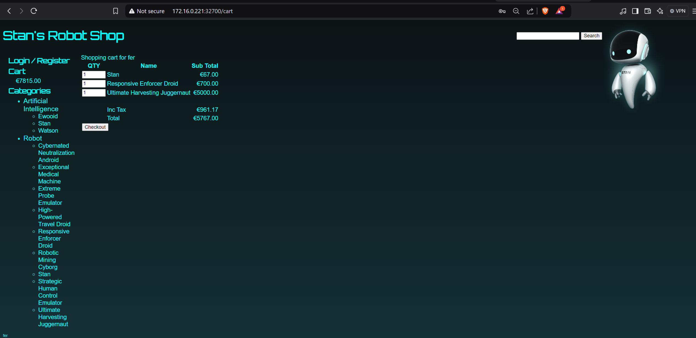
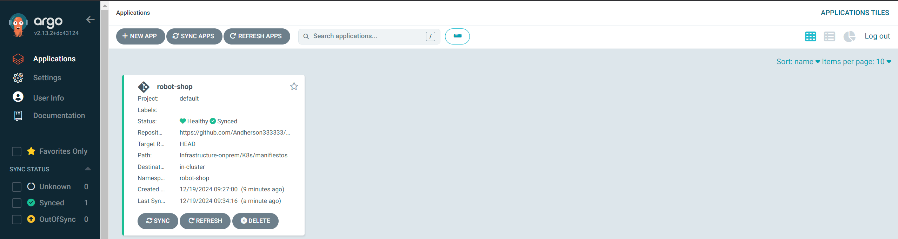
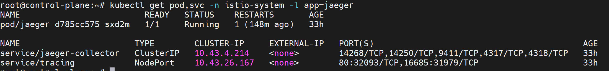

# Proyecto GitOps: Evolución Multi-Entorno de Microservicios con Robot Shop


Este proyecto implementa un enfoque progresivo para el despliegue de una aplicación de microservicios (Robot Shop) a través de tres entornos diferentes, aplicando prácticas modernas de DevOps, GitOps, observabilidad y seguridad.

##  Tabla de Contenidos

- [Descripción General](#descripción-general)
- [Fases de Implementación](#fases-de-implementación)
- [Arquitectura](#arquitectura)
- [Estructura del Repositorio](#estructura-del-repositorio)
- [Instrucciones de Despliegue](#instrucciones-de-despliegue)
- [CI/CD](#cicd)
- [Observabilidad](#observabilidad)
- [Patrones de Despliegue Avanzados](#patrones-de-despliegue-avanzados)
- [Aplicación Original Robot Shop](#aplicación-original-robot-shop)
- [Resolución de Problemas](#resolución-de-problemas)
- [Contribución](#contribución)
- [Licencia](#licencia)

##  Descripción General

Este repositorio extiende la aplicación Robot Shop original (desarrollada por Instana/IBM) implementando una progresión de despliegue en tres fases, desde un simple entorno de desarrollo local hasta una implementación completamente gestionada en la nube con múltiples herramientas de observabilidad y patrones avanzados de despliegue.

### Características Principales

- **Enfoque Multi-Entorno**: Progresión natural desde Docker Compose local hasta Kubernetes en AWS EKS
- **GitOps**: Gestión declarativa de la infraestructura utilizando Git como fuente única de verdad
- **CI/CD Automatizado**: Pipeline completo con análisis de calidad e integración continua
- **Observabilidad**: Stack completo de monitoreo, trazabilidad y telemetría
- **Patrones Avanzados de Despliegue**: Canary deployments con Istio y Flagger
- **Optimización de Costos**: Análisis y gestión de costos en AWS con Kubecost
- **Seguridad**: Análisis continuo con SonarCloud y mejores prácticas en Kubernetes

##  Fases de Implementación

### Fase 1: Docker Compose (Local)


Implementación sencilla utilizando contenedores Docker gestionados con Docker Compose, ideal para desarrollo local y pruebas iniciales.

**Características principales:**
- Configuración completa en `docker-compose.yaml`
- Inicialización rápida de todos los microservicios
- No requiere clústeres Kubernetes

### Fase 2: Kubernetes On-Premise


Despliegue en Kubernetes local con implementación de todas las características de orquestación y observabilidad esenciales.

**Características principales:**
- Manifiestos Kubernetes para todos los servicios
- Configuración de recursos para optimización
- Volúmenes persistentes para almacenamiento de datos
- Stack completo de observabilidad
- Despliegues progresivos con Istio y Flagger
- Pruebas de carga automatizadas


### Fase 3: Kubernetes EKS (Cloud)


Implementación completa en AWS EKS con infraestructura como código, observabilidad avanzada y optimización de recursos.

**Características principales:**
- Infraestructura como Código con Terraform
- Segregación de cargas por tipo de nodo
- Auto-scaling avanzado con Karpenter
- Integración con servicios AWS (EBS, Load Balancer)
- Monitoreo completo con análisis de costos
- Despliegue y configuración automáticos con ArgoCD



##  Arquitectura

### Microservicios de Robot Shop

La aplicación Robot Shop se compone de los siguientes microservicios:

- **Web**: Frontend en AngularJS servido por Nginx
- **Catalogue**: Servicio de catálogo de productos
- **User**: Gestión de usuarios y autenticación
- **Cart**: Carrito de compras
- **Shipping**: Cálculo de costos de envío
- **Payment**: Procesamiento de pagos
- **Ratings**: Sistema de valoraciones
- **Dispatch**: Gestión de envíos
- **MongoDB**: Base de datos para catálogo y usuarios
- **MySQL**: Base de datos para información de envíos
- **Redis**: Almacenamiento para carritos activos
- **RabbitMQ**: Procesamiento de la cola de pedidos

### Herramientas de Observabilidad y Gestión

- **Prometheus + Grafana**: Monitoreo y visualización de métricas
- **Jaeger**: Trazabilidad distribuida
- **Kiali**: Visualización de service mesh
- **Loki + Promtail**: Agregación y visualización de logs
- **Istio**: Service mesh para gestión avanzada de tráfico
- **Flagger**: Despliegues progresivos y canary testing
- **ArgoCD**: Implementación de GitOps
- **Metrics Server**: Métricas para HPA
- **Kubecost**: Análisis y optimización de costos (solo en EKS)

### Infraestructura en AWS (Fase EKS)

- **EKS**: Clúster Kubernetes gestionado
- **Karpenter**: Auto-scaling avanzado
- **EBS CSI Driver**: Almacenamiento persistente
- **AWS Load Balancer Controller**: Balanceo de carga
- **Node Groups**: Separación de nodos para infraestructura y aplicaciones

##  Estructura del Repositorio

```
robot-shop/
├── Infrastructure-cloud-EKS/        # Configuración para despliegue en AWS EKS
│   ├── infra-aplicacion/            # Configuración de la aplicación en EKS
│   │   ├── K8s/                     # Manifiestos Kubernetes para EKS
│   │   └── argocd/                  # Configuración de ArgoCD
│   ├── infra-node/                  # Componentes de infraestructura en EKS
│   │   ├── Argocd-helm/             # Helm charts para ArgoCD
│   │   ├── Flagger-helm/            # Helm charts para Flagger
│   │   ├── Isitio-helm/             # Helm charts para Istio
│   │   ├── Jagger/                  # Configuración de Jaeger
│   │   ├── Kiali/                   # Configuración de Kiali
│   │   ├── Loki-stack/              # Helm charts para Loki
│   │   ├── Prometheus-stack/        # Helm charts para Prometheus
│   │   ├── kubecost-helm/           # Helm charts para Kubecost
│   │   └── metrics-server/          # Configuración de Metrics Server
│   └── infra-terraform/             # Código Terraform para AWS
│       ├── EBS/                     # Configuración de EBS
│       ├── EKS/                     # Configuración de EKS
│       ├── Karpenter/               # Configuración de Karpenter
│       └── Loadbalancer-aws-nginx/  # Configuración de Load Balancer
├── Infrastructure-onprem/           # Configuración para Kubernetes on-premise
│   ├── Argo-cd-Operator/            # Configuración de ArgoCD
│   ├── Flagger-operator/            # Configuración de Flagger y canary deployments
│   ├── Istio-operator/              # Configuración de Istio
│   ├── Jagger/                      # Configuración de Jaeger
│   ├── K8s/                         # Manifiestos Kubernetes básicos
│   ├── Kiali/                       # Configuración de Kiali
│   ├── Prometheus-operator/         # Configuración de Prometheus
│   ├── loadtest/                    # Pruebas de carga
│   └── loki+promtail/               # Configuración de Loki y Promtail
├── cart/                            # Servicio de carrito de compras
├── catalogue/                       # Servicio de catálogo de productos
├── dispatch/                        # Servicio de envío
├── image/                           # Imágenes y capturas de pantalla
├── load-gen/                        # Utilidad de generación de carga
├── mongo/                           # Base de datos MongoDB
├── mysql/                           # Base de datos MySQL
├── payment/                         # Servicio de pagos
├── ratings/                         # Servicio de calificaciones
├── shipping/                        # Servicio de envíos
├── user/                            # Servicio de usuarios
├── web/                             # Frontend de la tienda
├── docker-compose.yaml              # Configuración para despliegue local
└── docker-compose3.yml              # Configuración alternativa de Docker Compose
```

##  Instrucciones de Despliegue

### Fase 1: Docker Compose

1. Clonar el repositorio:
   ```bash
   git clone https://github.com/Andherson333333/robot-shop.git
   cd robot-shop
   ```

2. Iniciar aplicación con Docker Compose:
   ```bash
   docker-compose up -d
   ```

3. Acceder a la aplicación:
   http://localhost:8080

### Fase 2: Kubernetes On-Premise

1. Configurar un cluster Kubernetes local (Minikube, Kind, etc.)
   ```bash
   minikube start --cpus=4 --memory=8192m --vm-driver=virtualbox
   ```

2. Aplicar los manifiestos básicos:
   ```bash
   kubectl apply -f Infrastructure-onprem/K8s/manifiestos/namespace.yaml
   kubectl apply -f Infrastructure-onprem/K8s/manifiestos/
   ```

3. Instalar observabilidad y herramientas:
   ```bash
   # Instalar Istio
   kubectl apply -f Infrastructure-onprem/Istio-operator/

   # Instalar Prometheus
   kubectl apply -f Infrastructure-onprem/Prometheus-operator/

   # Instalar Jaeger
   kubectl apply -f Infrastructure-onprem/Jagger/

   # Instalar Kiali
   kubectl apply -f Infrastructure-onprem/Kiali/

   # Instalar Loki
   kubectl apply -f Infrastructure-onprem/loki+promtail/
   
   # Instalar ArgoCD
   kubectl apply -f Infrastructure-onprem/Argo-cd-Operator/
   
   # Configurar Flagger para canary deployments
   kubectl apply -f Infrastructure-onprem/Flagger-operator/
   ```

4. Ejecutar pruebas de carga (opcional):
   ```bash
   kubectl apply -f Infrastructure-onprem/loadtest/loadtestCarga.yaml
   ```

5. Acceder a la aplicación:
   ```bash
   minikube service web -n robot-shop
   ```

### Fase 3: AWS EKS

1. Provisionar infraestructura con Terraform:
   ```bash
   cd Infrastructure-cloud-EKS/infra-terraform/EKS
   terraform init
   terraform apply
   
   cd ../EBS
   terraform init
   terraform apply
   
   cd ../Karpenter
   terraform init
   terraform apply
   
   cd ../Loadbalancer-aws-nginx
   terraform init
   terraform apply
   ```

2. Configurar kubectl para el nuevo cluster:
   ```bash
   aws eks update-kubeconfig --name robot-shop-eks --region us-east-1
   ```

3. Instalar componentes de observabilidad mediante ArgoCD:
   ```bash
   kubectl apply -f Infrastructure-cloud-EKS/infra-node/Argocd-helm/argocd/
   kubectl apply -f Infrastructure-cloud-EKS/infra-node/Prometheus-stack/argocd/
   kubectl apply -f Infrastructure-cloud-EKS/infra-node/Loki-stack/argocd/
   kubectl apply -f Infrastructure-cloud-EKS/infra-node/Isitio-helm/argocd/
   kubectl apply -f Infrastructure-cloud-EKS/infra-node/Jagger/argocd/
   kubectl apply -f Infrastructure-cloud-EKS/infra-node/Kiali/argocd/
   kubectl apply -f Infrastructure-cloud-EKS/infra-node/Flagger-helm/argocd/
   kubectl apply -f Infrastructure-cloud-EKS/infra-node/kubecost-helm/argocd/
   kubectl apply -f Infrastructure-cloud-EKS/infra-node/metrics-server/argocd/
   ```

4. Desplegar la aplicación Robot Shop:
   ```bash
   kubectl apply -f Infrastructure-cloud-EKS/infra-aplicacion/argocd/argocd-robot-shop.yml
   ```

##  CI/CD



El proyecto utiliza GitHub Actions para implementar un pipeline de CI/CD completo:

- **Cancelación Automática de Flujos**: Cancela ejecuciones redundantes para optimizar recursos de CI
- **Integración con SonarCloud**: Análisis de calidad y seguridad del código
- **Construcción de Imágenes Docker**: Construcción automatizada y envío a Docker Hub
- **Actualización de Manifiestos Kubernetes**: Actualización automática de archivos de despliegue con nuevas etiquetas de imagen
- **Control de Modo Producción**: Variable de entorno PRODUCTION_MODE para controlar el manejo de errores

### Flujo de Trabajo

1. Los cambios se envían a GitHub mediante push o pull request
2. GitHub Actions ejecuta análisis de código con SonarCloud
3. Si se aprueban las pruebas, se construyen imágenes Docker y se envían a Docker Hub
4. Los manifiestos de Kubernetes se actualizan automáticamente con las nuevas etiquetas de imagen
5. ArgoCD detecta los cambios en los manifiestos y sincroniza el estado del cluster

##  Observabilidad


### Herramientas Implementadas

- **Prometheus + Grafana**: Recolección de métricas y visualización
  - Dashboards para todos los servicios
  - Alertas configurables
  - Métricas personalizadas por servicio

- **Jaeger**: Trazabilidad distribuida
  
  - Seguimiento de transacciones completas
  - Análisis de latencia y rendimiento
  - Identificación de cuellos de botella

- **Kiali**: Visualización de service mesh
  
  - Topología de servicios
  - Análisis de tráfico
  - Estado de los servicios en tiempo real

- **Loki + Promtail**: Agregación de logs
  
  - Centralización de logs
  - Consultas y filtros avanzados
  - Correlación con métricas

- **Kubecost**: Análisis de costos (EKS)
  - Desglose de costos por namespace/aplicación
  - Recomendaciones de optimización
  - Proyecciones de costos

### URLs de Acceso

#### Kubernetes On-Premise
- Aplicación Robot Shop: http://localhost:80
- Grafana: http://localhost:3000
- Jaeger: http://localhost:16686
- Kiali: http://localhost:20001

#### AWS EKS
- Aplicación Robot Shop: https://robotshop.[EKS_DOMAIN]
- Grafana: https://grafana.[EKS_DOMAIN]
- Jaeger: https://jaeger.[EKS_DOMAIN]
- Kiali: https://kiali.[EKS_DOMAIN]
- Kubecost: https://kubecost.[EKS_DOMAIN]

##  Patrones de Despliegue Avanzados


### Canary Deployments con Flagger

El proyecto implementa despliegues canary para todos los microservicios utilizando Flagger e Istio:

```yaml
apiVersion: flagger.app/v1beta1
kind: Canary
metadata:
  name: web
  namespace: robot-shop
spec:
  provider: istio
  targetRef:
    apiVersion: apps/v1
    kind: Deployment
    name: web
  progressDeadlineSeconds: 60
  service:
    port: 8080
    targetPort: 8080
  analysis:
    interval: 30s
    threshold: 10
    maxWeight: 50
    stepWeight: 10
    metrics:
    - name: request-success-rate
      threshold: 99
      interval: 30s
    - name: request-duration
      threshold: 500
      interval: 30s
```

### Beneficios

- **Reducción de riesgos**: Las nuevas versiones se prueban con un subconjunto de usuarios antes del despliegue completo
- **Rollback automático**: Si se detectan errores, el sistema revierte automáticamente a la versión anterior
- **Métricas de rendimiento**: Análisis continuo de tasas de éxito y latencia
- **Despliegue gradual**: Control preciso sobre la velocidad de adopción de nuevas versiones

### Pruebas de Carga

Se incluyen configuraciones de prueba de carga para validar el rendimiento y la resiliencia:

- **HTTP Load Test**: Pruebas de carga HTTP básicas
- **TCP Load Test**: Pruebas de carga TCP para servicios internos
- **Error Test**: Pruebas de inyección de errores para validar resiliencia
- **Carga Sostenida**: Pruebas de carga sostenida para validar estabilidad

##  Aplicación Original Robot Shop

Stan's Robot Shop es una aplicación de microservicios creada por Instana/IBM como entorno de pruebas para técnicas de orquestación y monitorización. Incluye:

- NodeJS (Express)
- Java (Spring Boot)
- Python (Flask)
- Golang
- PHP (Apache)
- MongoDB
- Redis
- MySQL
- RabbitMQ
- Nginx
- AngularJS

Este proyecto extiende significativamente la aplicación original al implementar un enfoque de despliegue progresivo con herramientas modernas de DevOps y GitOps.

##  Resolución de Problemas

### Problemas Comunes en Docker Compose
- **Error al iniciar servicios**: Verificar puertos en uso y permisos de Docker
- **Problemas de conectividad entre servicios**: Revisar la configuración de red en docker-compose.yaml

### Problemas Comunes en Kubernetes On-Premise
- **PersistentVolumes en estado Pending**: Verificar la configuración de almacenamiento
- **Pods en CrashLoopBackOff**: Revisar logs con `kubectl logs -f [pod-name]`
- **Problemas con Istio**: Verificar la inyección del sidecar

### Problemas Comunes en EKS
- **Errores en Terraform**: Verificar permisos de AWS y límites de servicio
- **Problemas con LoadBalancer**: Revisar configuración de VPC y subredes
- **Karpenter no escala**: Verificar la configuración de NodePool

##  Contribución

Las contribuciones son bienvenidas. Por favor:
1. Haga un fork del repositorio
2. Cree una rama para su feature
3. Envíe un pull request

##  Licencia

Este proyecto está basado en Robot Shop de Instana/IBM y se distribuye bajo los mismos términos de licencia.
