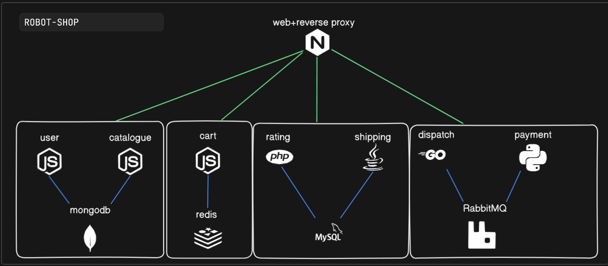

Spanish version of this README is available as readmeES.md

# 🤖 Robot Shop: Multi-Environment GitOps Implementation

<p align="center">
  
</p>

<p align="center">
  <a href="#environments">Environments</a> •
  <a href="#architecture">Architecture</a> •
  <a href="#features">Features</a> •
  <a href="#instructions">Instructions</a> •
  <a href="#observability">Observability</a> •
  <a href="#environment-comparison">Comparison</a>
</p>

## 📋 Description

This project implements the **Robot Shop** application across a progression of three environments: from local Docker Compose to Kubernetes in AWS EKS, applying modern DevOps, GitOps, observability, and security practices.

## 🌐 Environments

<table>
<tr>
  <td width="33%" align="center"><h3>Docker Compose</h3></td>
  <td width="33%" align="center"><h3>Kubernetes On-Premise</h3></td>
  <td width="33%" align="center"><h3>AWS EKS</h3></td>
</tr>
<tr>
  <td><b>Local and Simple</b><br>Ideal for development, quick to set up, no Kubernetes dependencies.</td>
  <td><b>Full Capabilities</b><br>Local Kubernetes implementation with monitoring, service mesh, and canary deployments.</td>
  <td><b>Cloud Production</b><br>Infrastructure as code, auto-scaling, high availability, and cost analysis.</td>
</tr>
</table>

## 🏗️ Architecture

### Microservices

<p align="center">
  
</p>

Robot Shop consists of **10 interconnected microservices**:

- **Frontend**: Nginx + AngularJS
- **Backend Services**: Catalogue, User, Cart, Shipping, Payment, Ratings, Dispatch
- **Databases**: MongoDB, MySQL, Redis
- **Messaging**: RabbitMQ

### Observability and DevOps

<p align="center">
  
</p>

Complete stack implemented in each environment:

- **Monitoring**: Prometheus + Grafana
- **Tracing**: Jaeger
- **Service Mesh**: Istio + Kiali
- **Logs**: Loki + Promtail
- **GitOps**: ArgoCD
- **Canary Deployments**: Flagger

## ✨ Features

<table>
<tr>
  <td><h3>📊 Complete Observability</h3>
    <ul>
      <li>Real-time metrics, logs, and traces</li>
      <li>Advanced service mesh visualization</li>
      <li>Configurable alerts</li>
      <li>Cost analysis (EKS)</li>
    </ul>
  </td>
  <td><h3>🔄 Automated CI/CD</h3>
    <ul>
      <li>Code analysis with SonarCloud</li>
      <li>Automated build and publishing</li>
      <li>Automatic manifest updates</li>
      <li>GitOps with ArgoCD</li>
    </ul>
  </td>
</tr>
<tr>
  <td><h3>🚢 Advanced Deployments</h3>
    <ul>
      <li>Automated canary deployments</li>
      <li>Automatic metric-based rollback</li>
      <li>Load and resilience testing</li>
      <li>High availability</li>
    </ul>
  </td>
  <td><h3>☁️ Infrastructure as Code</h3>
    <ul>
      <li>EKS clusters with Terraform</li>
      <li>Intelligent auto-scaling with Karpenter</li>
      <li>Node segregation by function</li>
      <li>Automatic provisioning</li>
    </ul>
  </td>
</tr>
</table>

## 📂 Project Structure

```
robot-shop/
├── Infrastructure-cloud-EKS/     # AWS EKS configuration
│   ├── infra-aplicacion/         # Application manifests
│   ├── infra-node/               # Observability tools
│   └── infra-terraform/          # Infrastructure as code
├── Infrastructure-onprem/        # Local K8s configuration
│   ├── K8s/                      # Basic manifests
│   ├── Istio-operator/           # Service mesh
│   ├── Prometheus-operator/      # Monitoring
│   └── ...                       # More components
├── [microservices]/              # Service source code
└── docker-compose.yaml           # Local configuration
```

## 🚀 Instructions

### 1. Docker Compose (Local)

```bash
# Clone repository
git clone https://github.com/Andherson333333/robot-shop.git
cd robot-shop

# Start application
docker-compose up -d

# Access: http://localhost:8080
```

### 2. Kubernetes On-Premise

```bash
# Start cluster
minikube start --cpus=4 --memory=8192m

# Deploy application
kubectl apply -f Infrastructure-onprem/K8s/manifiestos/namespace.yaml
kubectl apply -f Infrastructure-onprem/K8s/manifiestos/

# Deploy observability
kubectl apply -f Infrastructure-onprem/Istio-operator/
kubectl apply -f Infrastructure-onprem/Prometheus-operator/
# ... other components
```

### 3. AWS EKS (Cloud)

```bash
# Provision infrastructure
cd Infrastructure-cloud-EKS/infra-terraform/EKS
terraform init && terraform apply

# Configure kubectl
aws eks update-kubeconfig --name robot-shop-eks --region us-east-1

# Deploy components with ArgoCD
kubectl apply -f Infrastructure-cloud-EKS/infra-node/Argocd-helm/argocd/
kubectl apply -f Infrastructure-cloud-EKS/infra-aplicacion/argocd/
```

## 👁️ Observability

<table>
<tr>
  <td width="50%">
    <h3>Tracing with Jaeger</h3>
    
  </td>
  <td width="50%">
    <h3>Service Mesh with Kiali</h3>
    
  </td>
</tr>
<tr>
  <td>
    <h3>Metrics with Grafana</h3>
    
  </td>
  <td>
    <h3>Logs with Loki</h3>
    
  </td>
</tr>
</table>

## 🧪 Canary Deployments

<p align="center">
  
</p>

We implement progressive deployments with Flagger and Istio:

```yaml
apiVersion: flagger.app/v1beta1
kind: Canary
metadata:
  name: web
  namespace: robot-shop
spec:
  provider: istio
  # Progressive deployment configuration
  analysis:
    interval: 30s
    threshold: 10
    maxWeight: 50
    stepWeight: 10
    metrics:
    - name: request-success-rate
      threshold: 99
    - name: request-duration
      threshold: 500
```

## 📊 Environment Comparison

<table>
<tr>
  <th>Aspect</th>
  <th>Docker Compose</th>
  <th>Kubernetes On-Premise</th>
  <th>AWS EKS</th>
</tr>
<tr>
  <td><b>Infrastructure</b></td>
  <td>Local, minimal</td>
  <td>Local cluster</td>
  <td>Cloud, scalable</td>
</tr>
<tr>
  <td><b>Deployment</b></td>
  <td>Manual, simple</td>
  <td>kubectl + manifests</td>
  <td>GitOps + IaC</td>
</tr>
<tr>
  <td><b>Scalability</b></td>
  <td>Limited</td>
  <td>Basic HPA</td>
  <td>Advanced Karpenter</td>
</tr>
<tr>
  <td><b>Observability</b></td>
  <td>Basic</td>
  <td>Complete</td>
  <td>Complete + costs</td>
</tr>
<tr>
  <td><b>Advanced deployments</b></td>
  <td>No</td>
  <td>Yes (Flagger)</td>
  <td>Yes (Flagger)</td>
</tr>
<tr>
  <td><b>Persistence</b></td>
  <td>Docker volumes</td>
  <td>Local PV/PVC</td>
  <td>Managed EBS</td>
</tr>
<tr>
  <td><b>Ideal use case</b></td>
  <td>Development</td>
  <td>Testing/Staging</td>
  <td>Production</td>
</tr>
<tr>
  <td><b>Complexity</b></td>
  <td>Low</td>
  <td>Medium</td>
  <td>High</td>
</tr>
</table>

## 🔄 CI/CD

<p align="center">
  
  
</p>

Our pipeline implements:

- **Automatic workflow cancellation**: CI resource optimization
- **SonarCloud integration**: Code quality analysis
- **Docker image building**: Complete automation
- **Manifest updates**: GitOps management
- **Production control**: Differentiated handling by environment

## 🧰 Tools and Technologies

<table>
<tr>
  <td align="center"><br>Kubernetes</td>
  <td align="center"><br>Istio</td>
  <td align="center"><br>Prometheus</td>
  <td align="center"><br>ArgoCD</td>
</tr>
<tr>
  <td align="center"><br>Jaeger</td>
  <td align="center"><br>Flagger</td>
  <td align="center"><br>Loki</td>
  <td align="center"><br>Grafana</td>
<tr>
  <td align="center"><br>Docker</td>
  <td align="center"><br>Terraform</td>
  <td align="center"><br>AWS</td>
  <td align="center"><br>Kubecost</td>
</tr>
</tr>
</table>


## 📚 Original Robot Shop Application

This project extends the [Robot Shop application](https://github.com/instana/robot-shop) developed by Instana/IBM, implementing a progressive approach with modern DevOps and GitOps tools.

## 🤝 Contribution

Contributions are welcome. To contribute:
1. Fork the repository
2. Create a branch for your feature
3. Submit a pull request

## 📄 License

This project is based on Robot Shop by Instana/IBM and is distributed under the same license terms.
